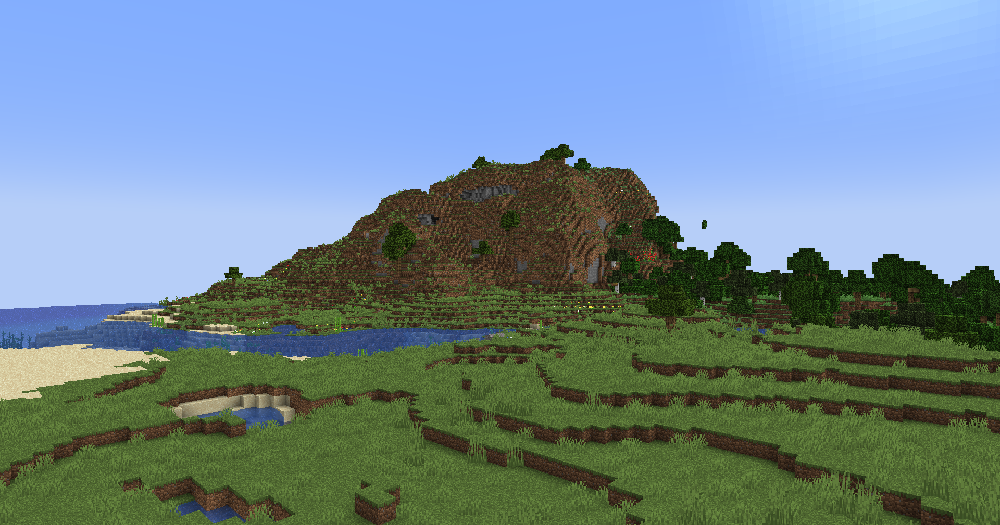
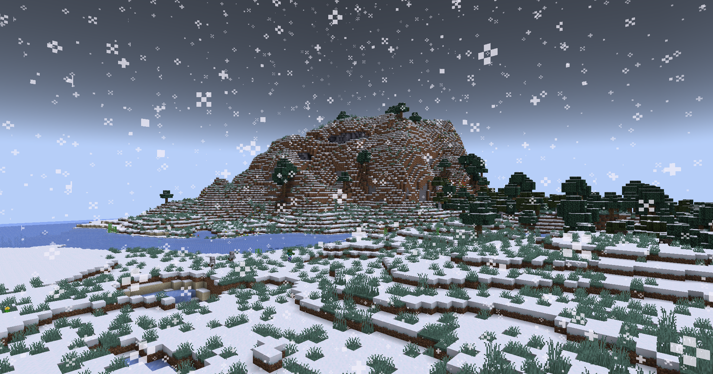

# Datapack Cold World

## Overview
The Datapack Cold World makes it possible for snow to fall everywhere, in all biomes, without changing their basic functions. Additionally, it freezes all the water on the surface, creating a truly cold and snowy world.

## Features
- Snowfall in all biomes
- Surface water freezes
- No changes to the basic functions of biomes

## Installation
1. Download the datapack.
2. Place the downloaded file in the `datapacks` folder of your world save.
3. Run the command `/reload` in your Minecraft world.

## Images

## Compatibility
- Minecraft version: 1.21

## Credits
- Created by Desside

## License
This datapack is licensed under the MIT License.

## Links
- [Modrinth Project Page](https://modrinth.com/project/datapack-cold-world)

Enjoy your new cold and snowy world!